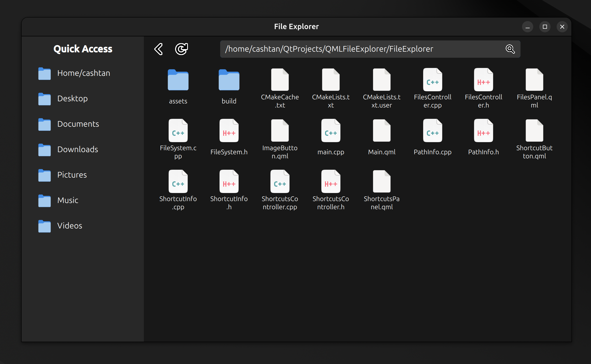

# Qt QML and C++ File Explorer

### About

Qt QML 6.5.3 and C++ 17 File Explorer, basic program.
This is my project for learning, nothing crazy.

### Build and run

For building I am using **CMake**. 

In scripts folder in **config_cmake.sh** specify path to your 
Qt library in `cmake -B build -DCMAKE_PREFIX_PATH=<your/path/to/Qt/gcc_64>`, 
e.g. `cmake -B build -DCMAKE_PREFIX_PATH=/home/cashtan/Qt/6.5.3/gcc_64`.

After you've done that, just type in terminal: 

To configure CMake: 
```
sh config_cmake.sh
```

To build and run: 
```
sh build.sh
```


### Preview image

